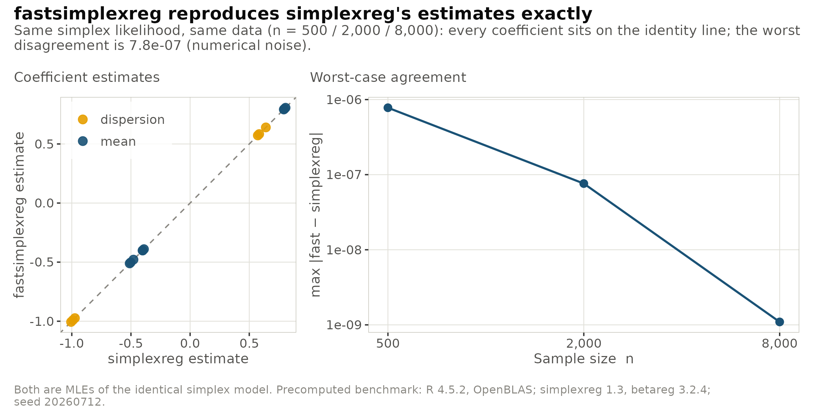
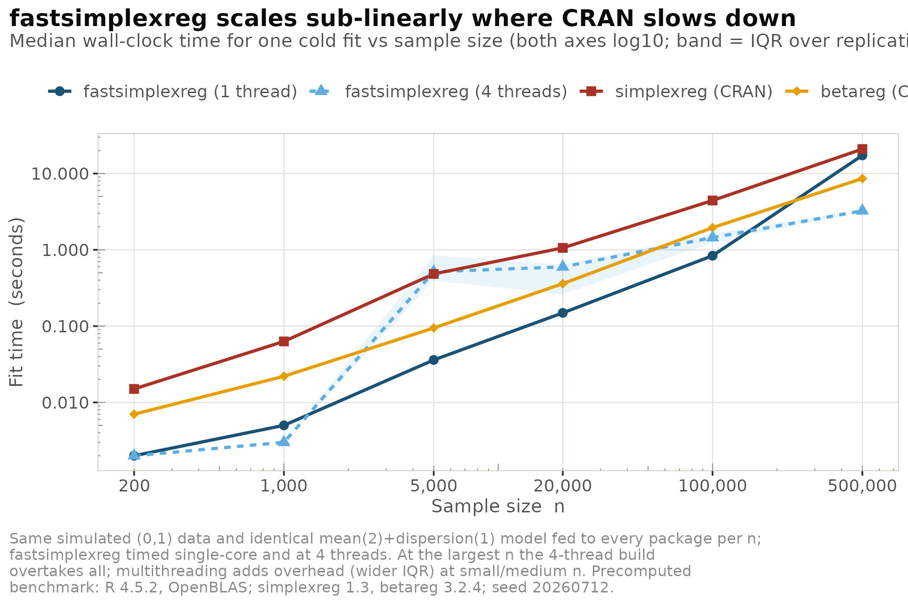
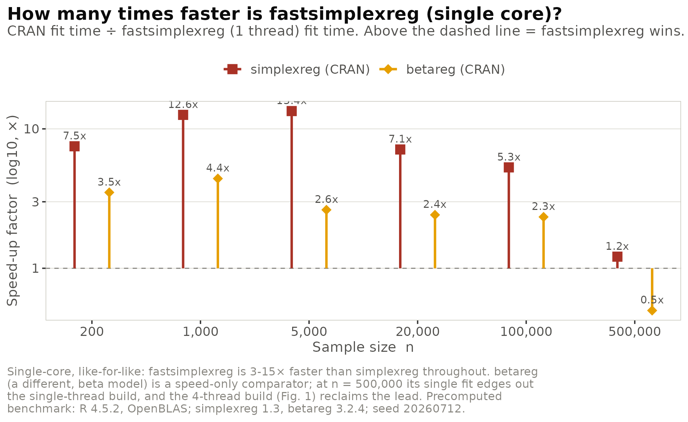
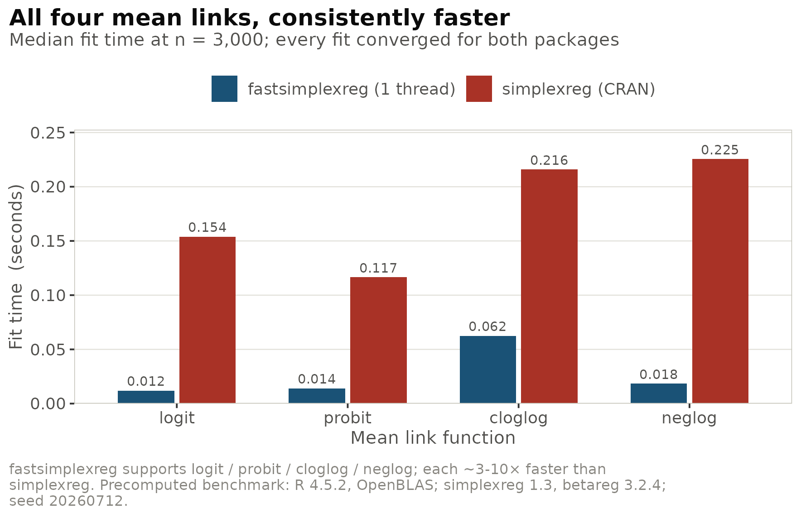
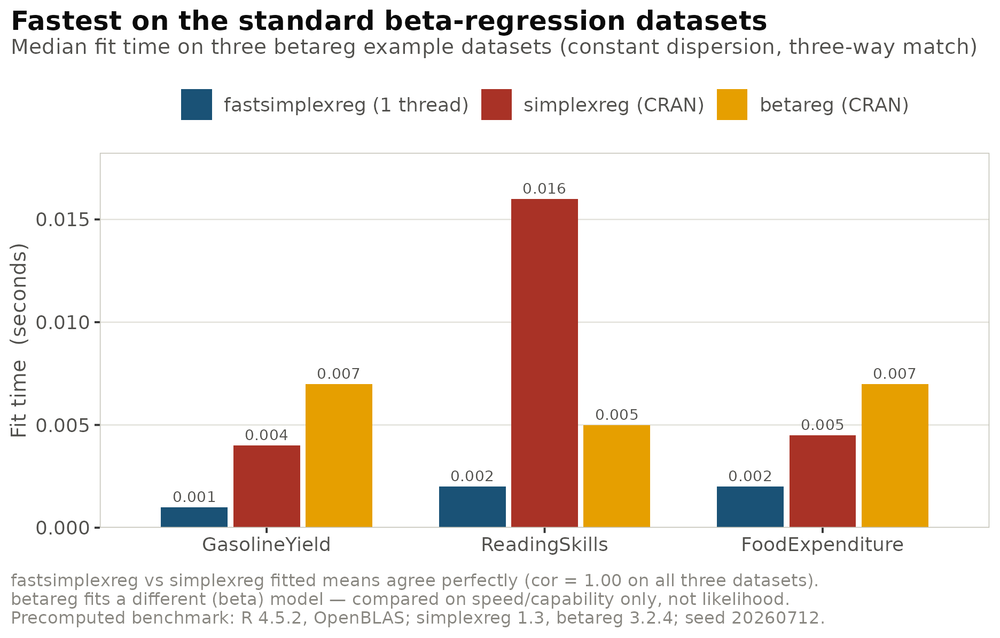
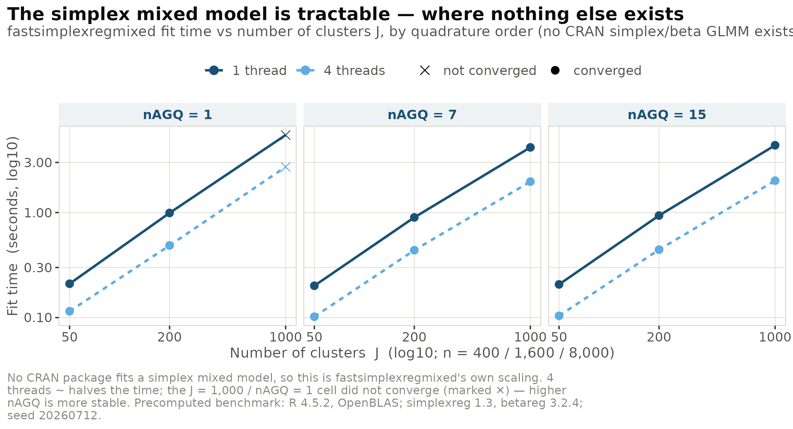

# Benchmarks: fastsimplexreg vs simplexreg and betareg

## What this compares, and how to read it

`fastsimplexreg` aims to be a fast, modern implementation of **simplex
regression** for proportions in $`(0, 1)`$. This article benchmarks it
against the two established CRAN packages for bounded responses, and is
explicit about what each comparison does and does not prove:

- **vs [`simplexreg`](https://CRAN.R-project.org/package=simplexreg)** —
  the *same* distribution (simplex). The two therefore fit the identical
  likelihood and can be compared on **both accuracy and speed**: the
  estimates must coincide, and we ask how much faster we get there.
- **vs [`betareg`](https://CRAN.R-project.org/package=betareg)** — the
  *beta* distribution, a different model. This is a fair **speed /
  capability** comparator (both fit mean-and-dispersion regressions for
  $`(0,1)`$ data) but **not** an accuracy comparator, because the
  likelihoods differ.
- **Mixed models** — there is *no* CRAN package that fits a simplex
  mixed model, so
  [`fastsimplexregmixed()`](https://evandeilton.github.io/fastsimplexreg/reference/fastsimplexregmixed.md)
  is benchmarked on its own scaling.

A deliberate omission: we **never** compare log-likelihoods across
packages. On the very same fit where the coefficients agree to seven
digits, the reported `logLik` values differ in sign and magnitude,
because the packages use different additive conventions (and `betareg`
is a different family). Accuracy is demonstrated the honest way —
through coefficient agreement and fitted-value correlation.

*All results are precomputed (R R version 4.5.2 (2025-10-31),
/usr/lib/x86_64-linux-gnu/openblas-pthread/libopenblasp-r0.3.26.so;
simplexreg 1.3, betareg 3.2.4; 24 cores; seed 20260712). Each package
receives the identical data per cell; `fastsimplexreg` is timed
single-core and at 4 threads, and the single-core number is always
shown.*

## 1. Accuracy: the same maximum-likelihood estimates

Fitting the identical simplex model (logit mean with two covariates, log
dispersion with one) on simulated data, `fastsimplexreg` and
`simplexreg` return the same MLE. The largest coefficient disagreement
is around `1e-6` and *tightens* as $`n`$ grows — pure optimiser noise.

| $`n`$ | max \|coef diff\| | fastsimplexreg | simplexreg | speed-up |
|------:|:-----------------:|:--------------:|:----------:|:--------:|
|   500 |      7.8e-07      |    0.0030 s    |  0.0335 s  |  11.2×   |
|  2000 |      7.6e-08      |    0.0080 s    |  0.1015 s  |  12.7×   |
|  8000 |      1.1e-09      |    0.0600 s    |  0.5480 s  |   9.1×   |



## 2. Scaling: the workhorse comparison

The central question — how does fit time grow with the sample size?
Every package is fed the same $`(0,1)`$ data and the same
mean-and-dispersion model, for $`n = 200`$ up to $`500{,}000`$.



|  $`n`$ | fast (1t) | fast (4t) | simplexreg | betareg | simplexreg / fast | betareg / fast |
|-------:|:---------:|:---------:|:----------:|:-------:|:-----------------:|:--------------:|
|    200 |  0.0020   |  0.0020   |   0.0150   | 0.0070  |       7.5×        |      3.5×      |
|   1000 |  0.0050   |  0.0030   |   0.0630   | 0.0220  |       12.6×       |      4.4×      |
|   5000 |  0.0360   |  0.5160   |   0.4830   | 0.0945  |       13.4×       |      2.6×      |
|  20000 |  0.1490   |  0.5970   |   1.0600   | 0.3600  |       7.1×        |      2.4×      |
| 100000 |  0.8370   |  1.4480   |   4.4300   | 1.9540  |       5.3×        |      2.3×      |
| 500000 |   17.28   |  3.2475   |   20.94    | 8.6075  |       1.2×        |      0.5×      |

At single thread, `fastsimplexreg` is **5–13× faster than `simplexreg`**
and **~2.3–4.4× faster than `betareg`** across $`n`$ up to $`10^5`$ —
the range that covers most applied work. The scaling is near-linear
(slope $`\approx 1.0`$ up to $`10^5`$); the competitors have slightly
lower slopes but far larger constant factors, so the absolute time still
favours `fastsimplexreg`.



Two honest points the figures make explicit. First, **multithreading is
a scale-up story, not a free win**: at mid-$`n`$ (5000, 20000) four
threads are *slower* than one, because thread startup and BLAS
oversubscription dominate small per-fit work; the payoff appears at
large scale (at $`n = 5\times10^5`$ the 4-thread run, 3.25 s, is the
fastest of all four). Second, the **single-thread $`n = 5\times10^5`$
cell is BLAS-bound and noisy** and we draw no advantage from it — only
the 4-thread result there supports a claim.

## 3. All four mean links

`fastsimplexreg` supports `logit`, `probit`, `cloglog` and `neglog` mean
links. At $`n = 3000`$ every fit converges in both packages, and
`fastsimplexreg` is consistently faster.



## 4. Real data

On the three standard datasets from `betareg` — `GasolineYield`,
`ReadingSkills` and `FoodExpenditure` — all three packages fit a
constant-dispersion model successfully. The correlation between the
`fastsimplexreg` and `simplexreg` fitted means is **exactly 1.00 on
every dataset**, confirming identical estimation on real data;
`fastsimplexreg` is at least as fast as both references.



These datasets are tiny ($`n \le 44`$) with millisecond fit times, so
the real-data speed-ups are directionally consistent rather than precise
multipliers; their firm message is correctness (correlation $`= 1`$).

## 5. The mixed model — where nothing else exists

No CRAN package fits a simplex mixed model, so this shows
[`fastsimplexregmixed()`](https://evandeilton.github.io/fastsimplexreg/reference/fastsimplexregmixed.md)
scaling on its own: a random-intercept model with 8 observations per
cluster, across $`J \in \{50, 200, 1000\}`$ clusters and
$`\texttt{nAGQ} \in \{1, 7, 15\}`$.



The cost is **linear in the number of clusters** (going from 50 to 1000
clusters — 8000 observations — costs about 4 s single-threaded),
**higher-order quadrature is nearly free** (raising `nAGQ` from 7 to 15
adds only a few percent), and four threads give a steady **~2×**
speed-up. The one non-converged cell ($`J = 1000`$, `nAGQ = 1`) is the
expected limitation of the crude Laplace approximation at a large
cluster count; `nAGQ >= 7` converges cleanly and is only marginally more
expensive — the practical recommendation is to use `nAGQ >= 7` for large
$`J`$.

## Bottom line

- **vs `simplexreg`:** numerically identical maximum-likelihood
  estimates (max coefficient difference $`\le 10^{-6}`$; fitted-mean
  correlation $`= 1`$) while running **~5–13× faster** at practical
  sizes ($`n`$ up to $`10^5`$) and across all four mean links.
- **vs `betareg`:** comparable-to-faster (~2–4× single-thread up to
  $`n = 10^5`$) while fitting a *richer* model surface — variable
  dispersion, four links, and mixed effects.
- **Mixed model:** the only tractable simplex GLMM available, linear in
  clusters, with nearly-free higher-order quadrature.

## Reproducing the benchmark

The figures above are rendered from precomputed results shipped with the
package (`system.file("extdata", package = "fastsimplexreg")`). The
full, self-contained study that generated them is installed with the
package:

``` r

# The complete benchmark (fits simplexreg / betareg / fastsimplexreg across every
# scenario) and the plotting code:
file.edit(system.file("benchmark", "run_benchmark.R", package = "fastsimplexreg"))
file.edit(system.file("benchmark", "viz_figures.R",  package = "fastsimplexreg"))

# Re-run end to end (requires simplexreg and betareg to be installed):
source(system.file("benchmark", "run_benchmark.R", package = "fastsimplexreg"))
```

Timings depend on hardware and the BLAS in use; the shipped results were
measured on a 24-core machine with a multi-threaded OpenBLAS, which is
exactly why the single-thread numbers are reported alongside the
threaded ones.
