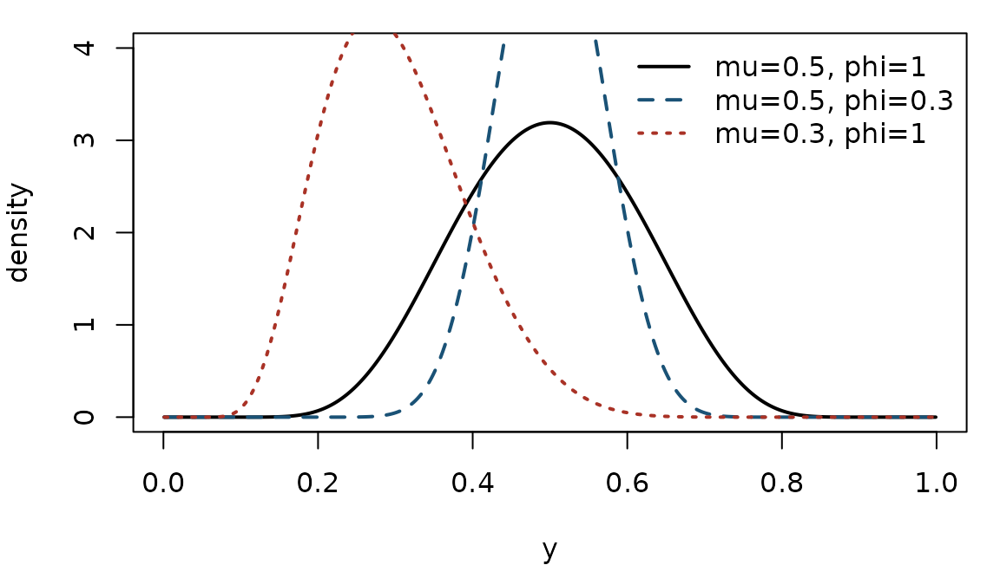
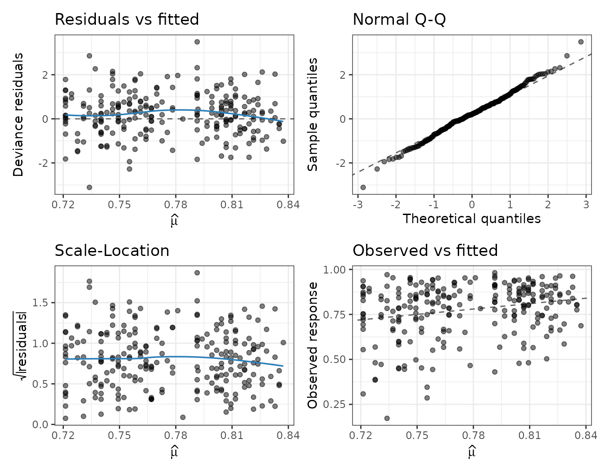

# Fast simplex regression with variable dispersion

## 1. Bounded proportions and the simplex distribution

Responses that are continuous **proportions** or **rates** restricted to
the open interval $`(0, 1)`$ — the fraction of a resource used, a
recovery rate, a concentration relative to a maximum — violate the
assumptions of ordinary linear regression: their support is bounded and
their variance is inherently heteroscedastic, shrinking towards the
boundaries $`0`$ and $`1`$. Two likelihood based models dominate this
setting: **beta regression** and **simplex regression**. This package
implements the latter.

The simplex distribution (Barndorff-Nielsen and Jørgensen, 1991) is a
member of the class of *dispersion models*. A random variable
$`Y \in (0, 1)`$ has a simplex distribution with mean $`\mu \in (0, 1)`$
and dispersion $`\phi > 0`$, written
$`Y \sim \mathrm{Simplex}(\mu, \phi)`$, if its density is
``` math
f(y; \mu, \phi) = \bigl[2\pi\,\phi\,\{y(1-y)\}^3\bigr]^{-1/2}
  \exp\!\left\{ -\frac{1}{2\phi}\, d(y; \mu) \right\},
\qquad
d(y; \mu) = \frac{(y-\mu)^2}{y(1-y)\,\mu^2(1-\mu)^2},
```
where $`d(y; \mu)`$ is the *unit deviance*. On the log scale,
``` math
\log f(y; \mu, \phi) = -\tfrac12\bigl(\log 2\pi + \log\phi\bigr)
  - \tfrac32\bigl(\log y + \log(1-y)\bigr) - \tfrac{1}{2\phi}\, d(y; \mu).
```
The mean of $`Y`$ is exactly $`\mu`$, and to first order in the
dispersion the variance is $`\mathrm{Var}(Y) \approx \phi\, V(\mu)`$
with the simplex **variance function** $`V(\mu) = \mu^3(1-\mu)^3`$ — the
variance is largest near $`\mu = 1/2`$ and vanishes at the boundaries.
The dispersion $`\phi`$ here is the $`\sigma^2`$ parameter of
Barndorff-Nielsen and Jørgensen (1991).

``` r

grid <- seq(0.001, 0.999, length.out = 400)
op <- par(mar = c(4, 4, 1, 1))
plot(grid, dsimplex(grid, mu = 0.5, phi = 1), type = "l", lwd = 2,
     xlab = "y", ylab = "density", ylim = c(0, 4))
lines(grid, dsimplex(grid, mu = 0.5, phi = 0.3), lwd = 2, lty = 2, col = "#1a5276")
lines(grid, dsimplex(grid, mu = 0.3, phi = 1),   lwd = 2, lty = 3, col = "#a93226")
legend("topright", bty = "n",
       legend = c("mu=0.5, phi=1", "mu=0.5, phi=0.3", "mu=0.3, phi=1"),
       lwd = 2, lty = 1:3, col = c("black", "#1a5276", "#a93226"))
```



``` r

par(op)
```

Smaller $`\phi`$ concentrates the mass around the mean; changing $`\mu`$
shifts and skews the density.

## 2. The regression model

[`fastsimplexreg()`](https://evandeilton.github.io/fastsimplexreg/reference/fastsimplexreg.md)
models both the mean and the dispersion as functions of covariates. For
observation $`i`$,
``` math
Y_i \sim \mathrm{Simplex}(\mu_i, \phi_i), \qquad
g(\mu_i) = x_i^\top\beta, \qquad
\log\phi_i = z_i^\top\gamma.
```
The dispersion always uses a log link (so $`\phi_i > 0`$). The mean link
$`g`$ can be **logit**, **probit**, **cloglog** or **neglog**:

| link    | $`g(\mu)`$               | $`g^{-1}(\eta)`$        |
|---------|--------------------------|-------------------------|
| logit   | $`\log\{\mu/(1-\mu)\}`$  | $`1/(1+e^{-\eta})`$     |
| probit  | $`\Phi^{-1}(\mu)`$       | $`\Phi(\eta)`$          |
| cloglog | $`\log\{-\log(1-\mu)\}`$ | $`1 - \exp(-e^{\eta})`$ |
| neglog  | $`-\log\{-\log\mu\}`$    | $`\exp(-e^{-\eta})`$    |

Estimation is by maximum likelihood. The log-likelihood, the **analytic
score**, a native **BFGS** optimiser, and the link inverses all run in
C++; the per-observation loop can use OpenMP, so the fit scales to very
large data sets.

### The multi-part formula interface

The mean and dispersion submodels are separated by `|` in a
[`Formula`](https://CRAN.R-project.org/package=Formula):

``` r

fastsimplexreg(y ~ x1 + x2 | z1 + z2, data = dat, link = "logit")
```

Here `y ~ x1 + x2` is the mean model and `z1 + z2` the dispersion model.
Omitting the second part, `y ~ x1 + x2`, gives constant dispersion.

## 3. A worked example: simulated recovery data

We simulate data loosely inspired by the recovery of CD34+ cells after
stem cell transplantation: the response `rcd` is a bounded recovery
rate, with covariates `ageadj` (adjusted age), `chemo` (chemotherapy
indicator) and `age`.

``` r

set.seed(1)
n <- 239
sdac <- data.frame(age = round(rnorm(n, 45, 12)),
                   ageadj = pmax(0, round(rnorm(n, 8, 6))),
                   chemo = rbinom(n, 1, 0.5))
mu <- simplex_linkinv(1.1 + 0.013 * sdac$ageadj + 0.25 * sdac$chemo, "logit")
sdac$rcd <- rsimplex(n, mu, exp(2.6 - 0.015 * sdac$age))
head(sdac)
#>   age ageadj chemo       rcd
#> 1  37      8     1 0.5653849
#> 2  47     12     0 0.9432660
#> 3  35     14     0 0.8502075
#> 4  64      9     0 0.4972992
#> 5  49      3     0 0.7329104
#> 6  35     15     0 0.7458922
```

We model the mean recovery rate through `ageadj` and `chemo`, and let
the dispersion depend on `age`:

``` r

fit <- fastsimplexreg(rcd ~ ageadj + chemo | age, data = sdac, link = "logit")
summary(fit)
#> 
#> Call:
#> fastsimplexreg(formula = rcd ~ ageadj + chemo | age, data = sdac, 
#>     link = "logit")
#> 
#> Pearson residuals:
#>      Min       1Q   Median       3Q      Max 
#> -2.65868 -0.42963  0.19730  0.60193  1.15765 
#> 
#> Coefficients (mean model with logit link):
#>             Estimate Std. Error z value Pr(>|z|)    
#> (Intercept) 0.950559   0.109785   8.658  < 2e-16 ***
#> ageadj      0.016059   0.009882   1.625 0.104161    
#> chemo       0.382829   0.105654   3.623 0.000291 ***
#> 
#> Coefficients (dispersion model with log link):
#>              Estimate Std. Error z value Pr(>|z|)    
#> (Intercept)  1.942640   0.376691   5.157 2.51e-07 ***
#> age         -0.003534   0.008081  -0.437    0.662    
#> ---
#> Signif. codes:  0 '***' 0.001 '**' 0.01 '*' 0.05 '.' 0.1 ' ' 1
#> 
#> Log-likelihood: 167.6 | AIC: -325.1 | BIC: -307.7 
#> Deviance:   239 | Observations: 239 | Iterations: 11 
#> Convergence: 0 - Converged: relative objective tolerance satisfied.
```

Positive mean coefficients indicate higher recovery with adjusted age
and with chemotherapy; the negative `age` coefficient in the dispersion
model means the recovery rate is **less variable** in older patients.
The fitted mean and dispersion are available directly:

``` r

head(cbind(mu = fitted(fit), phi = fitted(fit, "dispersion")))
#>             mu      phi
#> [1,] 0.8118171 6.121848
#> [2,] 0.7582792 5.909251
#> [3,] 0.7641173 6.165276
#> [4,] 0.7493392 5.564642
#> [5,] 0.7308100 5.867626
#> [6,] 0.7669995 6.165276
confint(fit)
#>                    2.5 %     97.5 %
#> (Intercept)  0.735385226 1.16573272
#> ageadj      -0.003310232 0.03542846
#> chemo        0.175751463 0.58990640
#> (Intercept)  1.204338590 2.68094164
#> age         -0.019372010 0.01230303
```

### Diagnostics

The [`plot()`](https://rdrr.io/r/graphics/plot.default.html) method
returns **ggplot2** panels (residuals vs fitted, a normal Q-Q plot,
scale-location, and observed vs fitted):

``` r

plot(fit, which = 1:4)
```



### Choosing a link

Because all four mean links are supported, they can be compared by AIC:

``` r

links <- c("logit", "probit", "cloglog", "neglog")
aic <- sapply(links, function(lk)
  AIC(fastsimplexreg(rcd ~ ageadj + chemo | age, data = sdac, link = lk)))
round(sort(aic), 2)
#>  neglog   logit  probit cloglog 
#> -325.21 -325.12 -325.03 -324.87
```

## 4. Density and simulation

The distribution utilities are vectorised and share the C++ backend:

``` r

dsimplex(c(0.2, 0.5, 0.8), mu = 0.5, phi = 1)
#> [1] 0.06924763 3.19153824 0.06924763
set.seed(42)
y <- rsimplex(1e4, mu = 0.35, phi = 0.8)
c(mean = mean(y), target_mu = 0.35)   # sample mean approximates mu
#>      mean target_mu 
#> 0.3487009 0.3500000
```

## 5. Performance notes

The critical path is entirely in C++: the log-likelihood and its
analytic score (so no numerical differentiation during optimisation), a
native BFGS that avoids repeated R/C++ crossings, BLAS matrix-vector
products for the linear predictors, and an optional OpenMP-parallelised
observation loop (`n_threads = 0` uses all cores). Inference (the
Hessian and standard errors) is computed only when `inference = TRUE`,
so exploratory fits on massive data can skip it.

## References

Barndorff-Nielsen, O. E. and Jørgensen, B. (1991). Some parametric
models on the simplex. *Journal of Multivariate Analysis*, **39**(1),
106-116.

Song, P. X.-K. and Tan, M. (2000). Marginal models for longitudinal
continuous proportional data. *Biometrics*, **56**(2), 496-502.

Zhang, P., Qiu, Z. and Shi, C. (2016). simplexreg: An R package for
regression analysis of proportional data using the simplex distribution.
*Journal of Statistical Software*, **71**(11), 1-21.
