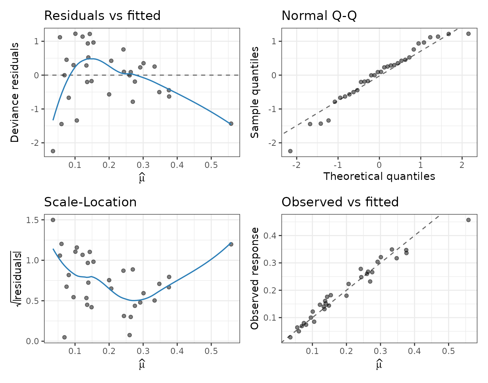

# Simplex mixed models for nested proportion data

## 1. Nested proportion data

Continuous proportions in $`(0, 1)`$ are frequently **nested**: repeated
measurements within a subject, students within schools, plots within
sites. The observations within a cluster are correlated, and treating
them as independent understates uncertainty and can bias both the mean
and the dispersion estimates.
[`fastsimplexregmixed()`](https://evandeilton.github.io/fastsimplexreg/reference/fastsimplexregmixed.md)
extends the simplex regression of
[`fastsimplexreg()`](https://evandeilton.github.io/fastsimplexreg/articles/fastsimplexreg.md)
with a cluster-specific random effect, while keeping the
variable-dispersion structure.

## 2. The two-level simplex mixed model

For observation $`i`$ in cluster $`j`$, conditionally on a cluster
random effect $`b_j \sim N_q(0, \Sigma)`$,
``` math
y_{ij} \mid b_j \sim \mathrm{Simplex}(\mu_{ij}, \phi_{ij}), \qquad
g(\mu_{ij}) = x_{ij}^\top\beta + z_{ij}^\top b_j, \qquad
\log\phi_{ij} = w_{ij}^\top\gamma .
```
The fixed effects $`\beta`$ (mean) and $`\gamma`$ (dispersion) use the
same multi-part `Formula` as the fixed-effects fit; the
$`q`$-dimensional random effect $`b_j`$ enters the mean submodel and
induces the within-cluster correlation. The mean link $`g`$ is one of
`logit`, `probit`, `cloglog`, `neglog`; the dispersion uses a log link
and carries fixed effects only.

Because the random effects are unobserved, the likelihood is the
**marginal** likelihood obtained by integrating them out,
``` math
\ell(\theta) = \sum_j \log \int_{\mathbb{R}^q}
  \exp\!\Big\{\textstyle\sum_i \log f(y_{ij}\mid b)\Big\}\,
  N(b; 0, \Sigma)\, \mathrm{d}b ,
```
which has no closed form.

### Adaptive Gauss-Hermite quadrature

The integral is approximated by **adaptive Gauss-Hermite quadrature**
(AGHQ). For each cluster the integrand is centred at its posterior mode
and rescaled by the curvature there, after which a Gauss-Hermite rule
with `nAGQ` points per dimension is applied. `nAGQ = 1` recovers the
**Laplace approximation**; larger `nAGQ` refines the integral, at the
cost of `nAGQ^q` evaluations per cluster. The random-effect covariance
$`\Sigma = D D^\top`$ is estimated on an unconstrained log-Cholesky
scale, so the estimate is always positive definite. The per-cluster
inner mode-finding, the quadrature and the analytic score run in C++ and
are parallelised over clusters with OpenMP.

### The `random` interface

Random effects and the grouping factor are supplied through `random`,
using the lme4-style bar:

- `random = ~ 1 | subject` — a random intercept;
- `random = ~ 1 + t | subject` — a random intercept and a random slope
  in `t`;
- `random = ~ 0 + t | subject` — a random slope only.

## 3. A worked example: gasoline yield by crude-oil batch

We use the `GasolineYield` data from the **betareg** package: the
response `yield` is the proportion of crude oil converted to gasoline,
measured across experimental settings of temperature `temp` for 10
crude-oil `batch`es (2-4 measurements each). Yields from the same batch
share the crude oil’s unmeasured properties — a natural nested
structure. We model the mean yield through `temp` and add a **random
intercept per batch**.

``` r

if (has_betareg) {
  data("GasolineYield", package = "betareg")
} else {
  # Synthetic stand-in so the vignette renders without 'betareg'.
  set.seed(1)
  J <- 10; nj <- 3; n <- J * nj
  batch <- factor(rep(seq_len(J), each = nj))
  temp <- rep(c(205, 275, 345), J) + rnorm(n, 0, 5)
  b <- rnorm(J, 0, 0.5)[batch]
  mu <- simplex_linkinv(-2.5 + 0.006 * temp + b, "logit")
  GasolineYield <- data.frame(yield = rsimplex(n, mu, exp(-1)), temp = temp,
                              batch = batch)
}
str(GasolineYield)
#> 'data.frame':    32 obs. of  6 variables:
#>  $ yield   : num  0.122 0.223 0.347 0.457 0.08 0.131 0.266 0.074 0.182 0.304 ...
#>  $ gravity : num  50.8 50.8 50.8 50.8 40.8 40.8 40.8 40 40 40 ...
#>  $ pressure: num  8.6 8.6 8.6 8.6 3.5 3.5 3.5 6.1 6.1 6.1 ...
#>  $ temp10  : num  190 190 190 190 210 210 210 217 217 217 ...
#>  $ temp    : num  205 275 345 407 218 273 347 212 272 340 ...
#>  $ batch   : Factor w/ 10 levels "1","2","3","4",..: 1 1 1 1 2 2 2 3 3 3 ...
#>   ..- attr(*, "contrasts")= num [1:10, 1:9] 1 0 0 0 0 0 0 0 0 0 ...
#>   .. ..- attr(*, "dimnames")=List of 2
#>   .. .. ..$ : chr [1:10] "1" "2" "3" "4" ...
#>   .. .. ..$ : chr [1:9] "1" "2" "3" "4" ...
```

``` r

fit <- fastsimplexregmixed(
  yield ~ temp,
  random = ~ 1 | batch,
  data = GasolineYield,
  link = "logit",
  nAGQ = 15,
  n_threads = 1
)
summary(fit)
#> 
#> Call:
#> fastsimplexregmixed(formula = yield ~ temp, data = GasolineYield, 
#>     random = ~1 | batch, link = "logit", nAGQ = 15, n_threads = 1)
#> 
#> Pearson residuals:
#>      Min       1Q   Median       3Q      Max 
#> -2.00837 -0.50439  0.09397  0.48606  1.32804 
#> 
#> Coefficients (mean model with logit link):
#>               Estimate Std. Error z value Pr(>|z|)    
#> (Intercept) -5.5767677  0.2709674  -20.58   <2e-16 ***
#> temp         0.0119791  0.0006187   19.36   <2e-16 ***
#> 
#> Coefficients (dispersion model with log link):
#>             Estimate Std. Error z value Pr(>|z|)    
#> (Intercept)  -1.1049     0.3047  -3.626 0.000288 ***
#> ---
#> Signif. codes:  0 '***' 0.001 '**' 0.01 '*' 0.05 '.' 0.1 ' ' 1
#> 
#> Random effects:
#> Random effects covariance (group: batch)
#>             Variance Std.Dev.
#> (Intercept)   0.3406   0.5836
#> 
#> Log-likelihood: 53.17 | AIC: -98.34 | BIC: -92.48 
#> Observations: 32 | Groups: 10 | nAGQ: 15 | Iterations: 18 
#> Convergence: 0 - Converged: relative objective tolerance satisfied.
```

The estimated between-batch variance and the group-level random effects:

``` r

VarCorr(fit)
#> Random effects covariance (group: batch)
#>             Variance Std.Dev.
#> (Intercept)   0.3406   0.5836
head(ranef(fit))
#>   (Intercept)
#> 1   0.9356345
#> 2   0.4541725
#> 3   0.6156294
#> 4   0.1598587
#> 5   0.1528583
#> 6   0.1309977
```

A non-negligible random-intercept variance confirms that batches differ
systematically in baseline yield beyond what temperature explains —
exactly the heterogeneity a fixed-effects fit on the pooled data would
ignore. The number of groups and the marginal fit statistics:

``` r

c(groups = ngrps(fit), nobs = nobs(fit))
#> groups   nobs 
#>     10     32
c(logLik = as.numeric(logLik(fit)), AIC = AIC(fit), BIC = BIC(fit))
#>    logLik       AIC       BIC 
#>  53.17239 -98.34478 -92.48184
```

### Conditional vs population predictions

By default [`predict()`](https://rdrr.io/r/stats/predict.html) is
**conditional** on the estimated random effects (a batch-specific
curve); `re.form = NA` gives the **population-level** (marginal-mode)
prediction with $`b = 0`$:

``` r

b1 <- levels(GasolineYield$batch)[1]
newd <- data.frame(temp = c(250, 350, 450),
                   batch = factor(b1, levels = levels(GasolineYield$batch)))
data.frame(
  temp        = newd$temp,
  conditional = predict(fit, newdata = newd, type = "response"),
  population  = predict(fit, newdata = newd, type = "response", re.form = NA)
)
#>   temp conditional population
#> 1  250   0.1616028 0.07030688
#> 2  350   0.3897324 0.20035584
#> 3  450   0.6790645 0.45359425
```

### Diagnostics

The [`plot()`](https://rdrr.io/r/graphics/plot.default.html) method
mirrors the fixed-effects diagnostics, with residuals computed
**conditional on the empirical-Bayes random effects**:

``` r

plot(fit, which = 1:4)
```



## 4. Choosing `nAGQ` and performance

`nAGQ` trades accuracy for cost. `nAGQ = 1` (Laplace) is fastest and is
often adequate when clusters are large; `nAGQ = 9`-`15` gives high
accuracy for small clusters. Since the tensor grid has
$`\mathtt{nAGQ}^q`$ nodes, keep the number of random effects small
($`q \le 3`$) and lower `nAGQ` as $`q`$ grows (good defaults: `11` for
$`q = 1`$, `9` for $`q = 2`$, `7` for $`q = 3`$). Because clusters are
conditionally independent, the work is parallelised over clusters — set
`n_threads = 0` to use all available cores.

## 5. Scope and extensions

This version supports a single grouping factor (two-level nesting),
Gaussian random effects in the mean submodel, and fixed-effect
(variable) dispersion. Crossed or three-level random effects, and random
effects in the dispersion submodel, are natural extensions for future
releases.

## References

Barndorff-Nielsen, O. E. and Jørgensen, B. (1991). Some parametric
models on the simplex. *Journal of Multivariate Analysis*, **39**(1),
106-116.

Pinheiro, J. C. and Bates, D. M. (1995). Approximations to the
log-likelihood function in the nonlinear mixed-effects model. *Journal
of Computational and Graphical Statistics*, **4**(1), 12-35.

Song, P. X.-K. and Tan, M. (2000). Marginal models for longitudinal
continuous proportional data. *Biometrics*, **56**(2), 496-502.
